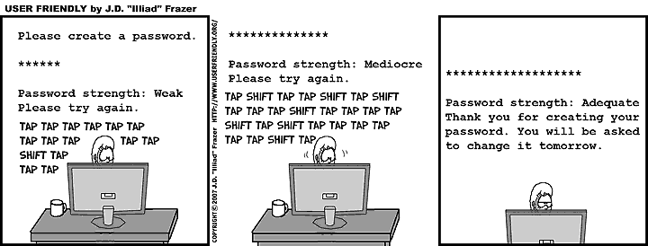
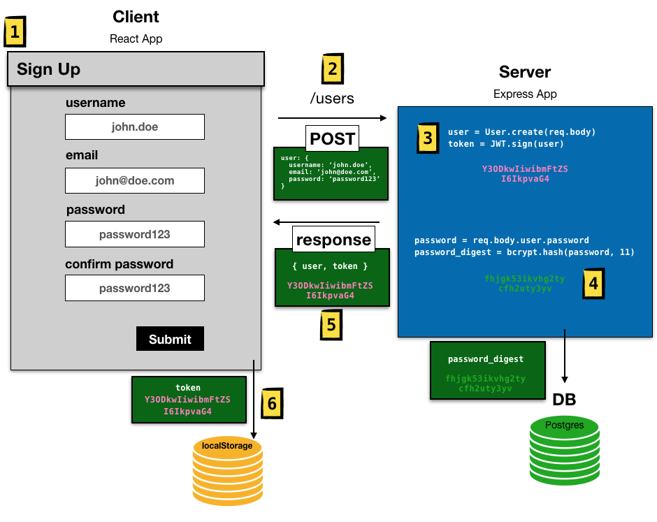
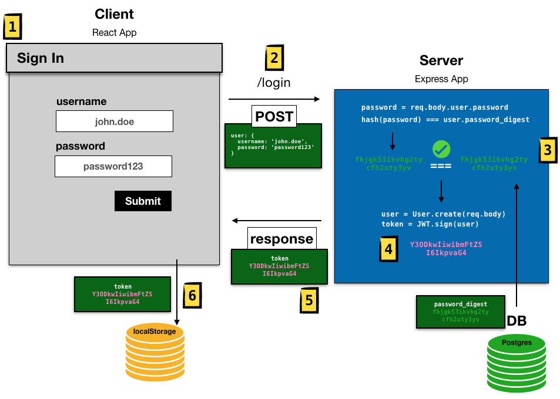

#   SOFTWARE ENGINEERING IMMERSIVE

# Authentication

## Prerequisites
- Express & React CRUD

## Learning Objectives
By the end of this, students should be able to:
- Understand & Implement Authentication

## Framing (5min)
Turn & Talk with your neighbor and answer the following:
- What is Authentication?
- What is Authorization
Bonus: What is the difference between hashing vs encrypting?

## Introduction

### Authentication

What is Authentication? Well it's the hardest topic in our curriculum. Ok joke aside, what is Auth?

We have learned how to create full-stack applications. There is a problem though. Often we want to limit what a user has access to. So how do we handle this? Welcome.. Authentication.

Authentication proves that the user is who he or she says they are. And with that information we can "authorize" the user to access whatever resources we would like to allow them to access.

The concept is a user can sign up and sign in aka authenticate. Then for specific resources we can check if they're authenticated - if they are, then allow them to interact with the resource otherwise, tell them they do not have access.

Cool so what does this look like?

Keywords:

### Authentication
### Authorization
### Hashing
### Encrypting
### Salt Rounds
### JWT
### JWT Token

## Sign Up

1. The user fills out a form on a react app including username, email, and password
2. Our react app makes a POST request to the `/users` api endpoint with the the user data (username, email, and password)
3. In our express app we:
- take the user data sent from the react app and create a new user in our postgres database
- we then user the [JWT library](https://jwt.io) to generate a token from the newly created user
4. For security reasons, we do not store raw passwords in our database. In this step we encrypt the user password, and store the encrypted password (password_digest) in the database
5. Our express app responds with the newly created user and the token we generated.
> This token is what the client will now use to identify that the user is who they say they are, instead of having to make a request with username/password every time we interact with the server.
6. Our react app takes the JWT token that it received from the server and stores it in the browser's localStorage

## Sign In

Given: The user has already signed up (the user is created in our database)

1. The user enters their username and password in our react app
2. Our react app makes a POST request to the `/login` endpoint on our server with username and password
3. We encrypt the password sent from the client and compare the encrypted password with the password_digest that was stored in our database. If they both match, the user is who they say they are. They are "authenticated".
4. If they are authenticated on the server, then we use the [JWT library](https://jwt.io) to create a JWT token for that user
> Remember the token is a unique identifier. Instead of us passing around username/password, the token is equivalent.
5. Have the server respond with the generated JWT token to the client
6. Our react app receives the token and stores it in [localStorage](https://developer.mozilla.org/en-US/docs/Web/API/Window/localStorage)

Why do we need to store the token in localStorage?

## Accessing a Protected Route / Resource

## Conclusion

Authentication is found in nearly every application we interact with. In this lesson we learned how to handroll our own authentication system. This has given us a thorough understanding of how authentication works. However, because authentication is what protects our application from unauthorized access it is crucial we use highly secure authentication system. We highly recommend, in real-world applications to use industry vetted third-party authentication libraries.

✊ **Fist to Five**

-- Happy Coding :)

## Feedback

> [Take a minute to give us feedback on this lesson so we can improve it!](https://forms.gle/vgUoXbzxPWf4oPCX6)
