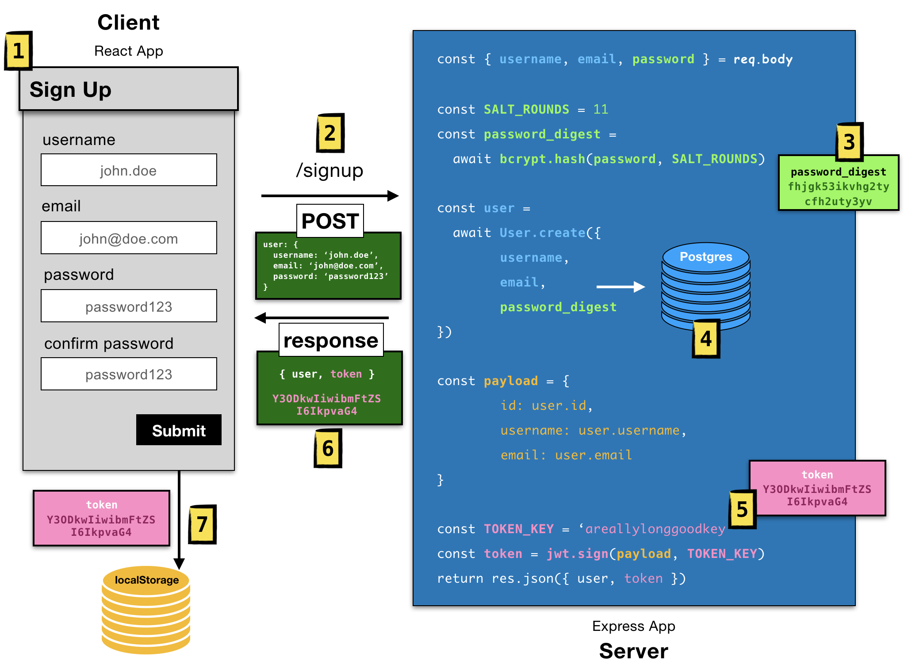
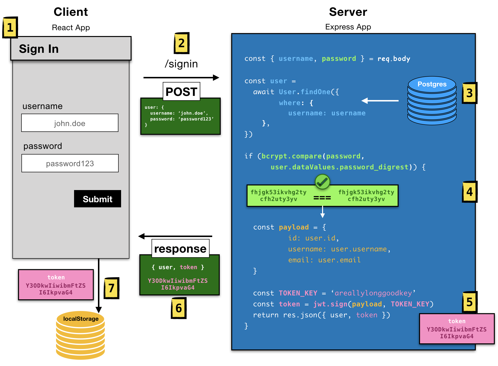

#   SOFTWARE ENGINEERING IMMERSIVE

# Authentication

## Prerequisites
- Express & React CRUD

## Learning Objectives
By the end of this, students should be able to:
- Understand & Implement Authentication

## Framing (5min)
Turn & Talk with your neighbor and answer the following:
- What is Authentication?
- What is Authorization

**Bonus**: What is the difference between hashing vs encrypting?

## Introduction

### Authentication

What is Authentication? Well it's the hardest topic in our curriculum. Ok joke aside, what is Auth?

We have learned how to create full-stack applications. There is a problem though. Often we want to limit what a user has access to. So how do we handle this? Welcome.. Authentication.

Authentication proves that the user is who he or she says they are. And with that information we can "authorize" the user to access whatever resources we would like to allow them to access.

The concept is a user can sign up and sign in aka authenticate. Then for specific resources we can check if they're authenticated - if they are, then allow them to interact with the resource otherwise, tell them they do not have access.

Cool so what does this look like?

TODO (Need to write about the following topics):

### Authentication
### Authorization
### Hashing
### Encrypting
### Salt Rounds
### JWT
### Token Key
### Payload
### JWT Token
### JWT Signing

## Sign Up

1. User fills out sign up form on the react app
2. User clicks submit, an axios POST request with a user object stored in the body of the request is created and sent to the `/signup` endpoint on the express server
3. We de-structure the request body - pulling out `username`, `email`, and `password`. We now create a `password_digest` by using `bcrypt`'s `hash` method to **encrypt** the user's `password` with a `SALT_ROUND` of 11
4. We can now create the user with the password digest and store that user in our database
5. Using a `TOKEN_KEY` we create a [JWT library](https://jwt.io) Token with a `payload` set to the user's credentials (`id`, `username`, `email`)
6. The Express server responds with the newly created `token` and `user` object
7. Our React app takes the `token` and stores it in [localStorage](https://developer.mozilla.org/en-US/docs/Web/API/Window/localStorage) so the user can remain logged in even when we reload the webpage

## Sign In

1. The user fills out the sign in form on the react app
2. User clicks submit, an axios POST request with a user object stored in the body of the request is created and sent to the `/signin` endpoint on the express server
3. We de-structure the request body - pulling out `username` and `password`. We use the `username` to find that specific user in our database to grab the `password_digest` for that user
4. We user `bcrypt.compare` method to `hash` the `password` and compare it with the `password_digest` - if they match, then that user is who they say they are
5. We create a JWT token and send it back along wuth the user as a response

## Accessing a Protected Resource

1. The user fills out the update form to edit a specific item
2. In our React app we check if there is a token in localStorage
3. We grab the token in localStorage and construct an axios PUT request with the token in the `header` of the request and the `item` object (with the modifications) in the body of the request
4. On our Express server we parse the `header` to grabe the token. We verify if the token is the original token using the `jwt.verify` method and the unique `TOKEN_KEY`
5. If the token is legit, we make the update in the database
6. We respond with the updated item

## Conclusion

Authentication is found in nearly every application we interact with. In this lesson we learned how to handroll our own authentication system. This has given us a thorough understanding of how authentication works. However, because authentication is what protects our application from unauthorized access it is crucial we use highly secure authentication system. We highly recommend, in real-world applications to use industry vetted third-party authentication libraries.

✊ **Fist to Five**

-- Happy Coding :)

## Feedback

> [Take a minute to give us feedback on this lesson so we can improve it!](https://forms.gle/vgUoXbzxPWf4oPCX6)
